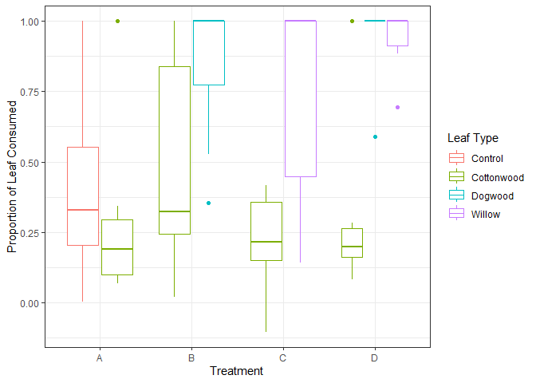
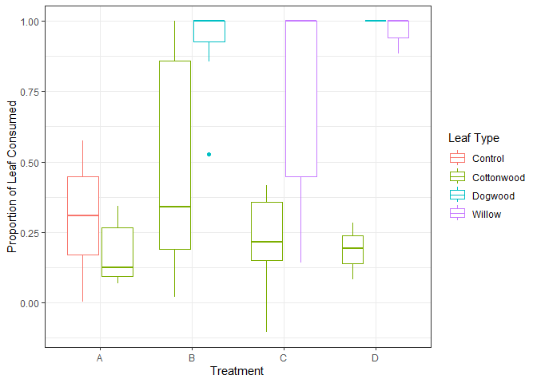
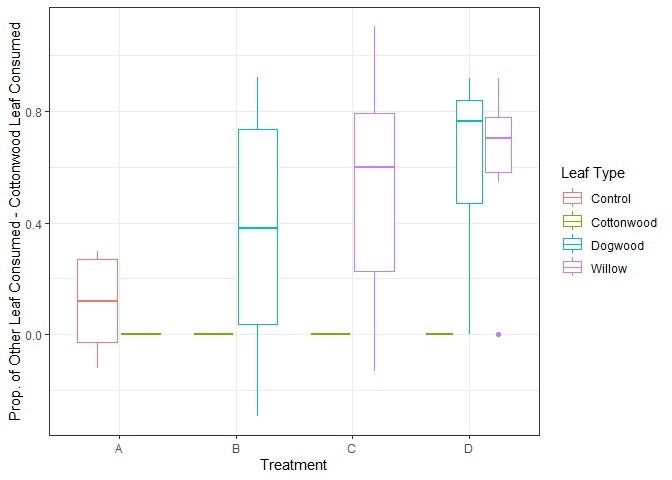
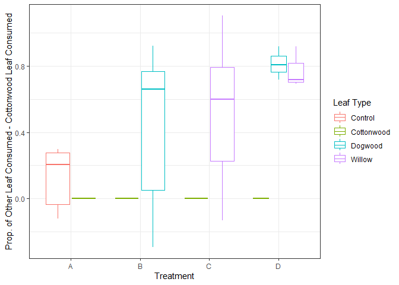
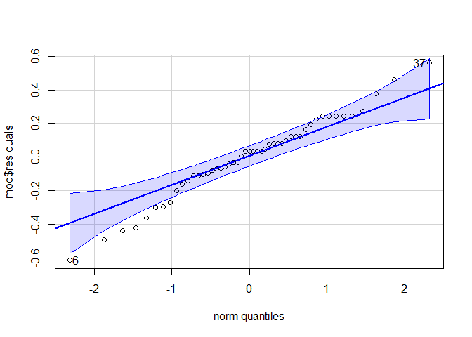

Consumption_Community_Ecology
================
Emily
2024-11-18

# This is the Consumption Analysis of the 2022 Community Ecology Lab Data

<br>

``` r
library(tidyverse)
library(dplyr)
library(car)
library(rstatix)
library(knitr)
library(outliers)
```

<br> \## Load Data

``` r
raw_data<-read_csv("C:\\github\\Salmonflies\\Data\\communityecologydata_2022.csv", n_max=84)
```

<br>

## Clean Data

Here, I removed Nas, calculate the proportion eaten and the difference
in proportion eaten compared to Cottonwood, and found and labeled
outliers

``` r
clean_LA <- raw_data |>
  select("treatment", "replicate", "leaf type", "leaf area initial", "leaf area final" )|>
  rename("leaftype"="leaf type", "initial_LA"="leaf area initial", "final_LA"="leaf area final")|>
  na.omit()|>
  convert_as_factor(leaftype, treatment)|>
  mutate(prop_eaten=(initial_LA-final_LA)/initial_LA)|>
  group_by(treatment, replicate)|>
  mutate(diffprop=prop_eaten-prop_eaten[leaftype=="Cottonwood"])|>
  ungroup()|>
  group_by(treatment, leaftype)|>
  mutate(IQR = IQR(prop_eaten), 
         o_upper = quantile(prop_eaten, probs=c( .75), na.rm = FALSE)+1.5*IQR,  
            o_lower = quantile(prop_eaten, probs=c( .25), na.rm = FALSE)-1.5*IQR, 
         outlier = if_else( o_lower <= prop_eaten & prop_eaten <= o_upper, F,T))|>
  ungroup()|>
  group_by(treatment, replicate)|>
  mutate(outlier = if_else(any(outlier == 'TRUE'), T, F))|>
  ungroup()


clean_LA |>
  head()|>
  kable()
```

| treatment | replicate | leaftype | initial_LA | final_LA | prop_eaten | diffprop | IQR | o_upper | o_lower | outlier |
|:---|---:|:---|---:|---:|---:|---:|---:|---:|---:|:---|
| A | 2 | Control | 92.989 | 64.340 | 0.3080902 | 0.2046135 | 0.3491351 | 1.0759872 | -0.3205530 | FALSE |
| A | 2 | Cottonwood | 125.980 | 112.944 | 0.1034767 | 0.0000000 | 0.1942355 | 0.5844796 | -0.1924625 | FALSE |
| B | 2 | Cottonwood | 161.286 | 29.162 | 0.8191908 | 0.0000000 | 0.5945689 | 1.7312465 | -0.6470293 | FALSE |
| B | 2 | Dogwood | 68.050 | 32.170 | 0.5272594 | -0.2919314 | 0.2269817 | 1.3404725 | 0.4325458 | FALSE |
| C | 2 | Cottonwood | 127.558 | 92.762 | 0.2727857 | 0.0000000 | 0.2048745 | 0.6632872 | -0.1562107 | FALSE |
| C | 2 | Willow | 70.217 | 60.266 | 0.1417178 | -0.1310679 | 0.5518970 | 1.8278455 | -0.3797426 | FALSE |

### Check to see counts of each treatment

``` r
clean_LA|>
  filter(outlier == FALSE)|>
  group_by(treatment)|>
  count() |>
  kable()
```

| treatment |   n |
|:----------|----:|
| A         |  14 |
| B         |  14 |
| C         |  12 |
| D         |   9 |

<br>

# Plotting Proportion Consumed and Difference of Proportion Consumed

``` r
clean_LA|>
  ggplot(aes(treatment, prop_eaten, color=leaftype))+
  geom_boxplot()+
  labs(x="Treatment", y="Proportion of Leaf Consumed", color="Leaf Type")+
  theme_bw()
```

<!-- -->

``` r
ggsave("Images/Community Ecology Proportion Consumed Boxplot.png")
```

    ## Saving 7 x 5 in image

``` r
clean_LA|>
  filter(outlier == FALSE)|>
  ggplot(aes(treatment, prop_eaten, color=leaftype))+
  geom_boxplot()+
  labs(x="Treatment", y="Proportion of Leaf Consumed", color="Leaf Type")+
  theme_bw()
```

<!-- -->

``` r
ggsave("Images/Community Ecology Proportion Consumed Boxplot_outliers_rm.png")
```

    ## Saving 7 x 5 in image

``` r
clean_LA|>
  ggplot(aes(treatment, diffprop, color=leaftype))+
  geom_boxplot()+
  labs(x="Treatment", y="Prop. of Other Leaf Consumed - Cottonwood Leaf Consumed", 
       color="Leaf Type")+
  theme_bw()
```

<!-- -->

``` r
ggsave("Images/Community Ecology Diff Prop Consumed Boxplot.png")
```

    ## Saving 7 x 5 in image

``` r
clean_LA|> 
  filter(outlier == FALSE) |>
  ggplot(aes(treatment, diffprop, color=leaftype))+
  geom_boxplot()+
  labs(x="Treatment", y="Prop. of Other Leaf Consumed - Cottonwood Leaf Consumed", 
       color="Leaf Type")+
  theme_bw()
```

<!-- -->

``` r
ggsave("Images/Community Ecology Diff Prop Consumed Boxplot_outliers_rm.png")
```

    ## Saving 7 x 5 in image

<br>

## Analysis: Testing for General Differences in Means

\###Plot Data

``` r
clean_LA|>
  filter(outlier == FALSE)|>
  group_by(treatment, leaftype)|>
  summarize(count=n(), mean=mean(prop_eaten), sd=sd(prop_eaten))|>
  kable()
```

    ## `summarise()` has grouped output by 'treatment'. You can override using the
    ## `.groups` argument.

| treatment | leaftype   | count |      mean |        sd |
|:----------|:-----------|------:|----------:|----------:|
| A         | Control    |     7 | 0.3027563 | 0.2119297 |
| A         | Cottonwood |     7 | 0.1796176 | 0.1101004 |
| B         | Cottonwood |     7 | 0.4938526 | 0.4052340 |
| B         | Dogwood    |     7 | 0.9117425 | 0.1779518 |
| C         | Cottonwood |     6 | 0.2125784 | 0.1906252 |
| C         | Willow     |     6 | 0.7343092 | 0.4134229 |
| D         | Cottonwood |     3 | 0.1856676 | 0.1002441 |
| D         | Dogwood    |     3 | 1.0000000 | 0.0000000 |
| D         | Willow     |     3 | 0.9613989 | 0.0668591 |

\###Check Sample Sizes

``` r
clean_LA_outlier_rm = clean_LA |>
  filter(outlier == FALSE)
  
  
table(clean_LA_outlier_rm$treatment, clean_LA_outlier_rm$leaftype) |>
  kable()
```

|     | Control | Cottonwood | Dogwood | Willow |
|:----|--------:|-----------:|--------:|-------:|
| A   |       7 |          7 |       0 |      0 |
| B   |       0 |          7 |       7 |      0 |
| C   |       0 |          6 |       0 |      6 |
| D   |       0 |          3 |       3 |      3 |

\###Check for Normality

I did this since the sample size is small

``` r
mod=aov(prop_eaten~treatment+leaftype, data=clean_LA_outlier_rm)
qqPlot(mod$residuals)
```

<!-- -->

    ## [1]  6 37

``` r
shapiro.test(mod$residuals) 
```

    ## 
    ##  Shapiro-Wilk normality test
    ## 
    ## data:  mod$residuals
    ## W = 0.98054, p-value = 0.5881

residuals are normal, p=.5581

<br>

### print model results

``` r
summary(mod)
```

    ##             Df Sum Sq Mean Sq F value   Pr(>F)    
    ## treatment    3  1.926  0.6421   9.761 5.21e-05 ***
    ## leaftype     3  2.567  0.8557  13.009 3.80e-06 ***
    ## Residuals   42  2.763  0.0658                     
    ## ---
    ## Signif. codes:  0 '***' 0.001 '**' 0.01 '*' 0.05 '.' 0.1 ' ' 1

``` r
TukeyHSD(mod, conf.level = .95)
```

    ##   Tukey multiple comparisons of means
    ##     95% family-wise confidence level
    ## 
    ## Fit: aov(formula = prop_eaten ~ treatment + leaftype, data = clean_LA_outlier_rm)
    ## 
    ## $treatment
    ##            diff         lwr        upr     p adj
    ## B-A  0.46161058  0.20229728 0.72092387 0.0001313
    ## C-A  0.23225683 -0.03764500 0.50215867 0.1138534
    ## D-A  0.47450189  0.18137716 0.76762661 0.0005085
    ## C-B -0.22935375 -0.49925558 0.04054809 0.1207761
    ## D-B  0.01289131 -0.28023341 0.30601603 0.9994082
    ## D-C  0.24224505 -0.06028712 0.54477723 0.1567107
    ## 
    ## $leaftype
    ##                          diff        lwr        upr     p adj
    ## Cottonwood-Control -0.2810848 -0.5772415 0.01507181 0.0683172
    ## Dogwood-Control     0.1699855 -0.1681177 0.50808864 0.5402583
    ## Willow-Control      0.1942443 -0.1515068 0.53999533 0.4449294
    ## Dogwood-Cottonwood  0.4510703  0.1911939 0.71094672 0.0001914
    ## Willow-Cottonwood   0.4753291  0.2055778 0.74508046 0.0001531
    ## Willow-Dogwood      0.0242588 -0.2909725 0.33949012 0.9968650

There is a significant difference in the amount of leaf eaten between
treatment and leaf type ( F = 9.761 and p \<.0001 under 3 df, and F =
13.009 and p \<.00001 under 3 df).

<br>

## Pairwise T tests using bonferroni correction methods

``` r
pairwiseT = clean_LA |>
  filter(outlier == FALSE) |>
  group_by(treatment)|>
  pairwise_t_test(prop_eaten~leaftype, 
                  paired=TRUE, p.adjust.method = "bonferroni")

pairwiseT|>
  kable()
```

| treatment | .y. | group1 | group2 | n1 | n2 | statistic | df | p | p.adj | p.adj.signif |
|:---|:---|:---|:---|---:|---:|---:|---:|---:|---:|:---|
| A | prop_eaten | Control | Cottonwood | 7 | 7 | 1.761745 | 6 | 0.129 | 0.129 | ns |
| B | prop_eaten | Cottonwood | Dogwood | 7 | 7 | -2.334936 | 6 | 0.058 | 0.058 | ns |
| C | prop_eaten | Cottonwood | Willow | 6 | 6 | -2.777078 | 5 | 0.039 | 0.039 | \* |
| D | prop_eaten | Cottonwood | Dogwood | 3 | 3 | -14.070309 | 2 | 0.005 | 0.015 | \* |
| D | prop_eaten | Cottonwood | Willow | 3 | 3 | -10.872022 | 2 | 0.008 | 0.025 | \* |
| D | prop_eaten | Dogwood | Willow | 3 | 3 | 1.000000 | 2 | 0.423 | 1.000 | ns |

The salmonflies ate significantly more Willow in both treatment C and D
(p=.039 under 5 df and p=.017 under 2 df, respectively). The salmonflies
ate significantly more Dogwood in treatment D when offered Cottonwood,
Willow, and Dogwood (p=.-24 under 5 df), but did not eat significantly
more Dogwood in treatment B when only offered Cottonwood or Dogwood (p =
.055 under 7df).
