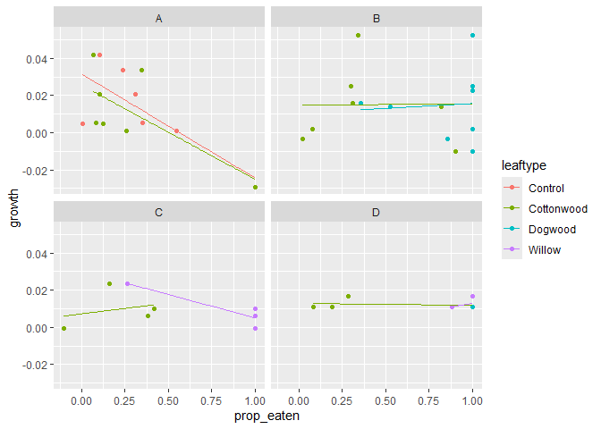
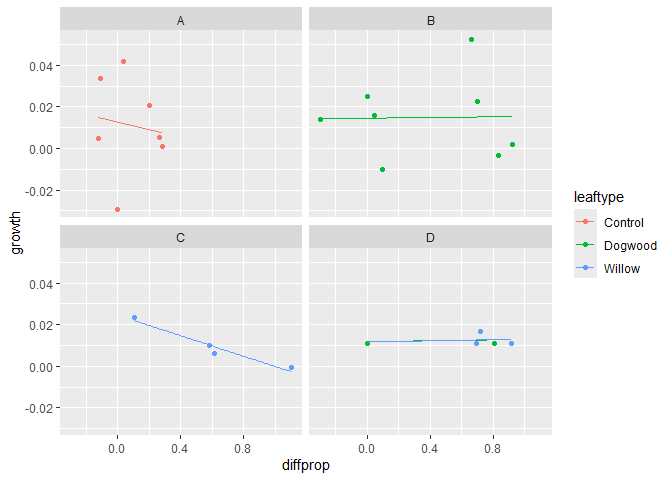

Community_Ecology_Growth
================
Emily
2024-11-18

# This is an exploration of the relationship between leaf type and Growth of Salmonflies

#### Load Packages

``` r
library(tidyverse)
library(dplyr)
library(car)
library(rstatix)
library(knitr)
library(outliers)
```

#### Load Data

``` r
raw_data<-read_csv("C:\\github\\Salmonflies\\Data\\communityecologydata_2022.csv", n_max=84)
```

#### Clean Data

``` r
clean_LA <- raw_data |>
  select("treatment", "replicate", "leaf type", "leaf area initial", 
         "leaf area final", "mass initial", "mass final")|>
  rename("leaftype"="leaf type", "initial_LA"="leaf area initial", 
         "final_LA"="leaf area final", "mass_i" = "mass initial", "mass_f" = "mass final" )|>
  na.omit()|>
  convert_as_factor(leaftype, treatment)|>
  mutate(growth = mass_f-mass_i, prop_eaten=(initial_LA-final_LA)/initial_LA, )|>
  group_by(treatment, replicate)|>
  mutate(diffprop=prop_eaten-prop_eaten[leaftype=="Cottonwood"])|>
  ungroup()|>
  group_by(treatment, leaftype)|>
  mutate(eaten_IQR = IQR(prop_eaten), 
         o_upper_eaten = quantile(prop_eaten, probs=c( .75), na.rm = FALSE)+1.5*eaten_IQR,  
            o_lower_eaten = quantile(prop_eaten, probs=c( .25), na.rm = FALSE)-1.5*eaten_IQR, 
         eaten_outlier = if_else( o_lower_eaten <= prop_eaten & prop_eaten <= o_upper_eaten, F,T),
         growth_IQR = IQR(growth), 
         o_upper_growth = quantile(growth, probs=c( .75), na.rm = FALSE)+1.5*growth_IQR,  
            o_lower_growth = quantile(growth, probs=c( .25), na.rm = FALSE)-1.5*growth_IQR, 
         growth_outlier = if_else( o_lower_growth <= growth & growth <= o_upper_growth, F,T))|>
  ungroup()|>
  group_by(treatment, replicate)|>
  mutate(eaten_outlier = if_else(any(eaten_outlier == 'TRUE'), T, F), 
         growth_outlier = if_else(any(growth_outlier == 'TRUE'), T, F))|>
  ungroup()
```

\##3 Plot Growth

``` r
clean_LA |>
  filter(growth_outlier==FALSE)|>
  ggplot(aes(prop_eaten, growth, color = leaftype))+
  geom_point()+
  geom_smooth(method = "lm", se = FALSE, linewidth = .3) +
  facet_wrap(~treatment)
```

<!-- -->

``` r
clean_LA |>
  filter(growth_outlier==FALSE, leaftype != "Cottonwood") |>
  ggplot(aes(diffprop, growth, color = leaftype))+
  geom_point()+
  geom_smooth(method = "lm", se=FALSE, linewidth = .3)+
  facet_wrap(~treatment)
```

<!-- -->
<br>

## Analysis

## Filter the outliers oout

``` r
filtered_LA = clean_LA|>
  filter(growth_outlier == FALSE)
```

## ANOVA Test for difference in means between Treatments

``` r
anova_result <- aov(growth~ treatment, data = filtered_LA)

summary(anova_result)
```

There is no difference in means between the treatment types for
salmonfly growth.
