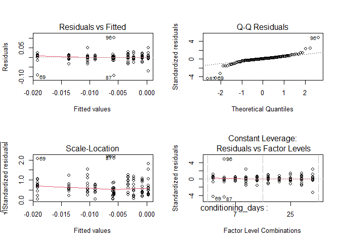
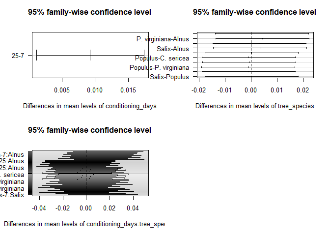
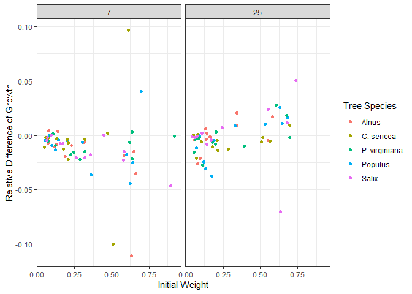
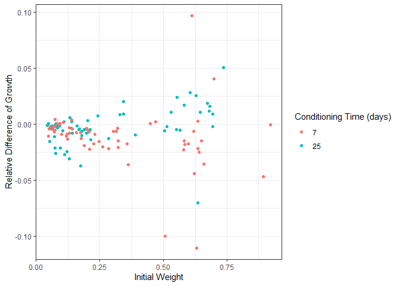

Growth Analysis
================
Emily
2024-11-07

## This document is the analysis of the Salmonfly Leaf Experiment

``` r
library(dplyr)
library(tidyverse)
library(janitor)
```

### PREP DATA

Load the conditioning growth data for both 7 and 25 days of conditioning

``` r
raw_growth = read_csv("C:\\github\\Salmonflies\\Data\\Allgrowth.csv")
```

<br>

Cleaning data to make the names better, mutating into correct types, and
adding a column to calculate the difference and relative difference of
weights. This will be used to later calculate the differences between
means within each conditioning period and difference in means between 7
days of conditioning and 25 days of conditioning

``` r
clean_growth = raw_growth |>
  clean_names() |>
  rename(tree_species = species, initial_g = initial, final_g = final, 
         conditioning_days = conditioning)|>
  select(conditioning_days, tree_species, initial_g, final_g) |>
  mutate(conditioning_days = as_factor(conditioning_days),
         diff_g= initial_g - final_g, 
         relative_diff = (initial_g - final_g)/initial_g)

seven_growth = clean_growth |>
  filter(conditioning_days == 7)

twentyfive_growth = clean_growth |>
  filter(conditioning_days == 25)
```

<br>

# Analysis

### Average Means

#### Under 7 Days of Conditioning

``` r
seven_growth |>
group_by(tree_species) |>
summarize(mean = mean(diff_g))
```

    ## # A tibble: 5 × 2
    ##   tree_species      mean
    ##   <chr>            <dbl>
    ## 1 Alnus         -0.0193 
    ## 2 C. sericea    -0.00579
    ## 3 P. virginiana -0.00905
    ## 4 Populus       -0.0104 
    ## 5 Salix         -0.0137

Overall, eating only leaves conditioned for 7 days resulted in a loss of
growth.

#### Under 25 Days of Conditioning

``` r
twentyfive_growth |>
group_by(tree_species) |>
summarize(mean = mean(diff_g))
```

    ## # A tibble: 5 × 2
    ##   tree_species       mean
    ##   <chr>             <dbl>
    ## 1 Alnus         -0.000742
    ## 2 C. sericea    -0.00593 
    ## 3 P. virginiana -0.00231 
    ## 4 Populus       -0.00327 
    ## 5 Salix          0.000333

Individuals lost weight when consuming alder, dogwood, chokecherry, and
cottonwood, and gained weight when consuming willow.

### Testing for differences of growth means between conditioning times

``` r
reg3 = lm(diff_g~conditioning_days*tree_species, data= clean_growth)
anova(reg3)
```

    ## Analysis of Variance Table
    ## 
    ## Response: diff_g
    ##                                 Df   Sum Sq    Mean Sq F value  Pr(>F)  
    ## conditioning_days                1 0.002571 0.00257058  5.1033 0.02585 *
    ## tree_species                     4 0.000292 0.00007310  0.1451 0.96480  
    ## conditioning_days:tree_species   4 0.001242 0.00031055  0.6165 0.65165  
    ## Residuals                      110 0.055408 0.00050371                  
    ## ---
    ## Signif. codes:  0 '***' 0.001 '**' 0.01 '*' 0.05 '.' 0.1 ' ' 1

``` r
par(mfrow=c(2,2))
plot(reg3)
```

<!-- -->

``` r
tapply(X=clean_growth$diff_g, INDEX= clean_growth$tree_species, FUN=sd)
```

    ##         Alnus    C. sericea P. virginiana       Populus         Salix 
    ##    0.02498105    0.02987057    0.01226072    0.02018566    0.02237658

``` r
car::leveneTest(aov(diff_g ~ conditioning_days, data=clean_growth)) 
```

    ## Levene's Test for Homogeneity of Variance (center = median)
    ##        Df F value Pr(>F)
    ## group   1  0.5212 0.4717
    ##       118

``` r
plot(TukeyHSD(aov(reg3)), las=1)
```

<!-- -->
We found no significant difference in growth between individuals
consuming leaves that had been conditioned for 25 days and leaves that
had been conditioned for 7 days (ANOVA F=.6165, P = .65165), though
overall conditioning time was also a strong predictor of growth (ANOVA F
= 5.1033 P=0.02585).

<br>

### ANOVA for relationship between initial weight, tree species, and growth for 7 and 25 days of conditioning

#### Under 7 Days of conditioning

``` r
seven_growth_lm = lm(diff_g~initial_g*tree_species, data = seven_growth)

anova(seven_growth_lm)
```

    ## Analysis of Variance Table
    ## 
    ## Response: diff_g
    ##                        Df   Sum Sq    Mean Sq F value Pr(>F)
    ## initial_g               1 0.001475 0.00147539  2.2957 0.1360
    ## tree_species            4 0.001139 0.00028476  0.4431 0.7769
    ## initial_g:tree_species  4 0.004387 0.00109665  1.7064 0.1633
    ## Residuals              50 0.032134 0.00064268

There is no evidence of an interaction between treatment type and
initial weight, therefore, treatment type did not affect the growth rate
of individuals (F= 1.71, P=0.1633 on 9 and 50 df)

<br>

#### Under 25 Days of Conditioning

``` r
twentyfive_growth_lm = lm(diff_g~initial_g*tree_species, data = twentyfive_growth)

anova(twentyfive_growth_lm)
```

    ## Analysis of Variance Table
    ## 
    ## Response: diff_g
    ##                        Df    Sum Sq    Mean Sq F value   Pr(>F)   
    ## initial_g               1 0.0031496 0.00314964 11.8045 0.001198 **
    ## tree_species            4 0.0004037 0.00010093  0.3783 0.823064   
    ## initial_g:tree_species  4 0.0009131 0.00022828  0.8556 0.497068   
    ## Residuals              50 0.0133408 0.00026682                    
    ## ---
    ## Signif. codes:  0 '***' 0.001 '**' 0.01 '*' 0.05 '.' 0.1 ' ' 1

We found that initial weight is a strong predictor of salmonfly growth
when feeding on 25-day conditioned leaves (ANOVA, P=0.00120, Table 2),
regardless of the type of leaf (ANOVA, F= .8556, P=0.497).

<br>

### ANOVA for relationship between conditioning days and initial mass

``` r
conditioning_lm = lm(diff_g~conditioning_days*initial_g, data = clean_growth)

anova(conditioning_lm)
```

    ## Analysis of Variance Table
    ## 
    ## Response: diff_g
    ##                              Df   Sum Sq   Mean Sq F value  Pr(>F)   
    ## conditioning_days             1 0.002571 0.0025706  5.6996 0.01858 * 
    ## initial_g                     1 0.000125 0.0001246  0.2762 0.60021   
    ## conditioning_days:initial_g   1 0.004500 0.0045005  9.9786 0.00202 **
    ## Residuals                   116 0.052317 0.0004510                   
    ## ---
    ## Signif. codes:  0 '***' 0.001 '**' 0.01 '*' 0.05 '.' 0.1 ' ' 1

There was also a significant interaction between initial weight of the
stoneflies and the conditioning period, indicating that initial weight
influences the growth of salmonflies differently, depending on
conditioning time (ANOVA, F = 9.9786 P=0.00202)

<br>

### Testing for difference of means between tree species

#### 7 days of conditioning

``` r
reg1 = lm(diff_g~tree_species, data= seven_growth)

anova(reg1)
```

    ## Analysis of Variance Table
    ## 
    ## Response: diff_g
    ##              Df   Sum Sq    Mean Sq F value Pr(>F)
    ## tree_species  4 0.001254 0.00031344  0.4551 0.7683
    ## Residuals    55 0.037881 0.00068875

``` r
par(mfrow=c(2,2))
plot(reg1)
```

<!-- -->

``` r
tapply(X=seven_growth$diff_g, INDEX= seven_growth$tree_species, FUN=sd)
```

    ##         Alnus    C. sericea P. virginiana       Populus         Salix 
    ##   0.030585274   0.042461993   0.009029799   0.021082364   0.013388765

``` r
car::leveneTest(aov(diff_g ~ tree_species, data=seven_growth)) 
```

    ## Warning in leveneTest.default(y = y, group = group, ...): group coerced to
    ## factor.

    ## Levene's Test for Homogeneity of Variance (center = median)
    ##       Df F value Pr(>F)
    ## group  4  0.5853 0.6746
    ##       55

``` r
plot(TukeyHSD(aov(reg1)), las=1)
```

<!-- -->

Summary statistics of reg1 show that there is no evidence of a
difference in growth of salmonflies between leaf species (ANOVA F =
.455, P = .768).

The windows() stuff shows that the data are normal.

The tapply shows the standard deviations of the data.

leveneTest shows that the variances are equal (F = .5853, p = .6746)

TukeyHSD shows graphically there are no difference in means.

#### Under 25 days of Conditioning

``` r
reg2 = lm(diff_g~tree_species, data= twentyfive_growth)

anova(reg2)
```

    ## Analysis of Variance Table
    ## 
    ## Response: diff_g
    ##              Df    Sum Sq    Mean Sq F value Pr(>F)
    ## tree_species  4 0.0002809 0.00007021  0.2203  0.926
    ## Residuals    55 0.0175265 0.00031866

``` r
par(mfrow=c(2,2))
plot(reg2)
```

<!-- -->

``` r
tapply(X=twentyfive_growth$diff_g, INDEX= twentyfive_growth$tree_species, FUN=sd)
```

    ##         Alnus    C. sericea P. virginiana       Populus         Salix 
    ##   0.013504104   0.007911111   0.014421793   0.019480309   0.027584427

``` r
car::leveneTest(aov(diff_g ~ tree_species, data=twentyfive_growth)) 
```

    ## Warning in leveneTest.default(y = y, group = group, ...): group coerced to
    ## factor.

    ## Levene's Test for Homogeneity of Variance (center = median)
    ##       Df F value Pr(>F)
    ## group  4  1.2176 0.3139
    ##       55

``` r
plot(TukeyHSD(aov(reg2)), las=1)
```

<!-- -->
Under 25 days of conditioning, we found no evidence of a difference in
average growth between leaf treatment types (ANOVA, F=0.2203, P=0.926)

<br>

### Creating Large Vs Small salmonflies and calculating growth differences between salmonfly size

#### Under 7 days of conditioning

``` r
size_seven_growth = clean_growth |>
  mutate(size = case_when( initial_g > .37 ~ "large", initial_g <.37  ~ "small")) |>
  filter(conditioning_days == 7)


size_7days_lm=lm(diff_g~size, data=size_seven_growth)

anova(size_7days_lm)
```

    ## Analysis of Variance Table
    ## 
    ## Response: diff_g
    ##           Df   Sum Sq    Mean Sq F value Pr(>F)
    ## size       1 0.001020 0.00101988   1.552 0.2179
    ## Residuals 58 0.038115 0.00065716

There was no difference in growth between large (greater than 0.37 g)
and small individuals (ANOVA, F= 1.552, p = 0.2179 with 58 df).

#### Under 25 Days of Conditioning

``` r
size_twentyfive_growth = clean_growth |>
  mutate(size = case_when( initial_g > .37 ~ "large", initial_g <.37  ~ "small")) |>
  filter(conditioning_days == 25)


size_25days_lm=lm(diff_g~size, data=size_twentyfive_growth)

anova(size_25days_lm)
```

    ## Analysis of Variance Table
    ## 
    ## Response: diff_g
    ##           Df    Sum Sq    Mean Sq F value   Pr(>F)   
    ## size       1 0.0021521 0.00215208  7.9731 0.006496 **
    ## Residuals 58 0.0156553 0.00026992                    
    ## ---
    ## Signif. codes:  0 '***' 0.001 '**' 0.01 '*' 0.05 '.' 0.1 ' ' 1

Size was a strong predictor of salmonfly growth when eating leaves
conditioned for 25 days (ANOVA, F = 7.9731, p = .0065 with 58 df)

<br>

## Plots

``` r
clean_growth |>
  group_by(tree_species)|>
  ggplot(aes(tree_species, relative_diff, color = conditioning_days)) +
  geom_boxplot()+
  labs(x = "Tree Species", y = "Relative Difference of Growth", 
       color = "Leaf Conditioning Time (days)") +
  facet_wrap(~conditioning_days, nrow= 2)+
  theme_bw()
```

<!-- -->

``` r
ggsave("Relative Growth Difference in Tree Species.png", path = "Images")
```

<br>

Scatterplot of Growth vs initial stonefly weight

``` r
clean_growth |>
  group_by(tree_species)|>
  ggplot(aes(initial_g, diff_g, color = tree_species)) +
  geom_point()+
  labs(x = "Initial Weight", y = "Relative Difference of Growth", 
       color = "Tree Species") +
  facet_wrap(~conditioning_days, nrow= 1)+
  theme_bw()
```

<!-- -->

``` r
ggsave("Growth Difference vs Initial Weight Separated.png", path = "Images")
```

<br>

Growth vs Initial Weight of stoneflies

``` r
clean_growth |> 
  ggplot(aes(initial_g, diff_g, color = conditioning_days)) +
  geom_point()+
  labs(x = "Initial Weight", y = "Relative Difference of Growth", 
       color = "Conditioning Time (days)") +
  theme_bw()
```

<!-- -->

``` r
ggsave("Growth Difference vs Initial Weight.png", path = "Images")
```
