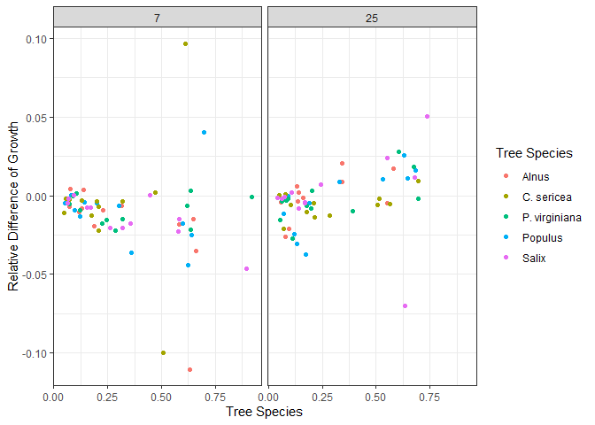
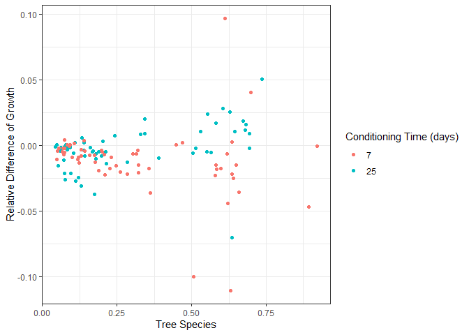

Growth Analysis
================
Emily
2024-11-07

## This document is the start of attempting again to publish my undergraduate work

``` r
library(dplyr)
library(tidyverse)
library(janitor)
```

Load the conditioning growth data for both 7 and 25 days of conditioning

``` r
raw_growth = read_csv("C:\\Users\\emily\\OneDrive\\Documents\\Undergrad\\Undergrad year 4\\Thesis\\Analysis\\Data\\Allgrowth.csv")
```

Cleaning data to make the names better, mutating into correct types, and
adding a column to calculate the difference and relative difference of
weights. This will be used to later calculate the differences between
means within each conditioning period and difference in means between 7
days of conditioning and 25 days of conditioning

``` r
clean_growth = raw_growth |>
  clean_names() |>
  rename(tree_species = species, initial_g = initial, final_g = final)|>
  select(conditioning_days, tree_species, initial_g, final_g) |>
  mutate(conditioning_days = as_factor(conditioning_days),
         diff_g= initial_g - final_g, 
         relative_diff = (initial_g - final_g)/initial_g)
```

\]

``` r
clean_growth |>
  group_by(tree_species)|>
  ggplot(aes(tree_species, relative_diff, color = conditioning_days)) +
  geom_boxplot()+
  labs(x = "Tree Species", y = "Relative Difference of Growth", 
       color = "Leaf Conditioning Time (days)") +
  facet_wrap(~conditioning_days, nrow= 2)+
  theme_bw()
```

<!-- -->
<br>

Scatterplot of Growth vs initial stonefly weight

``` r
clean_growth |>
  group_by(tree_species)|>
  ggplot(aes(initial_g, diff_g, color = tree_species)) +
  geom_point()+
  labs(x = "Tree Species", y = "Relative Difference of Growth", 
       color = "Tree Species") +
  facet_wrap(~conditioning_days, nrow= 1)+
  theme_bw()
```

<!-- -->

<br>

Growth vs Initial Weight of stoneflies

``` r
clean_growth |> 
  ggplot(aes(initial_g, diff_g, color = conditioning_days)) +
  geom_point()+
  labs(x = "Tree Species", y = "Relative Difference of Growth", 
       color = "Conditioning Time (days)") +
  theme_bw()
```

<!-- -->

# Calculating ANOVA and LM of difference between means for 7 and 25 days of conditioning on the growth of salmonflies

``` r
seven_growth = clean_growth |>
  filter(conditioning_days == 7)

seven_growth_lm = lm(diff_g~initial_g*tree_species, data = seven_growth)

anova(seven_growth_lm)
```

    ## Analysis of Variance Table
    ## 
    ## Response: diff_g
    ##                        Df   Sum Sq    Mean Sq F value Pr(>F)
    ## initial_g               1 0.001475 0.00147539  2.2957 0.1360
    ## tree_species            4 0.001139 0.00028476  0.4431 0.7769
    ## initial_g:tree_species  4 0.004387 0.00109665  1.7064 0.1633
    ## Residuals              50 0.032134 0.00064268

    Testing for difference of means for between tree species under 25 days of conditioning

    ``` r
    twentyfive_growth = clean_growth |>
      filter(conditioning_days == 25)

    twentyfive_growth_lm = lm(diff_g~initial_g*tree_species, data = twentyfive_growth)

    anova(twentyfive_growth_lm)

    ## Analysis of Variance Table
    ## 
    ## Response: diff_g
    ##                        Df    Sum Sq    Mean Sq F value   Pr(>F)   
    ## initial_g               1 0.0031496 0.00314964 11.8045 0.001198 **
    ## tree_species            4 0.0004037 0.00010093  0.3783 0.823064   
    ## initial_g:tree_species  4 0.0009131 0.00022828  0.8556 0.497068   
    ## Residuals              50 0.0133408 0.00026682                    
    ## ---
    ## Signif. codes:  0 '***' 0.001 '**' 0.01 '*' 0.05 '.' 0.1 ' ' 1

Found that tree species didn’t affect growth at 25 days of conditioning,
so now testing conditioning days and initial mass

``` r
conditioning_lm = lm(diff_g~conditioning_days*initial_g, data = clean_growth)

anova(conditioning_lm)
```

    ## Analysis of Variance Table
    ## 
    ## Response: diff_g
    ##                              Df   Sum Sq   Mean Sq F value  Pr(>F)   
    ## conditioning_days             1 0.002571 0.0025706  5.6996 0.01858 * 
    ## initial_g                     1 0.000125 0.0001246  0.2762 0.60021   
    ## conditioning_days:initial_g   1 0.004500 0.0045005  9.9786 0.00202 **
    ## Residuals                   116 0.052317 0.0004510                   
    ## ---
    ## Signif. codes:  0 '***' 0.001 '**' 0.01 '*' 0.05 '.' 0.1 ' ' 1
